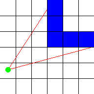
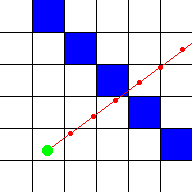
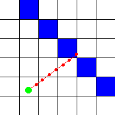
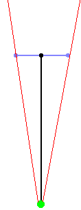

# **Ray casting**

## **1. 개요**

레이캐스팅은 2차원 맵에서 3차원의 원근감을 구현하기 위한 **렌더링 기술**이다. [나무위키의 레이캐스팅](https://namu.wiki/w/%EB%A0%88%EC%9D%B4%EC%BA%90%EC%8A%A4%ED%8C%85?from=%EB%A0%88%EC%9D%B4%EC%BA%90%EC%8A%A4%ED%8A%B8)에 대한 정의는 다음과 같다.

> 레이캐스팅은 가상의 공간에 보이지 않는 빛(Ray)을 투사해 빛에 닿는 표면을 파악하는 기술이다.

레이캐스팅이 게임에 처음 활용된 곳이 바로 FPS게임이다. 90년대 초, 당시 컴퓨터 성능으로는 3D 게임을 상상할 수 없었지만  `Wolfenstein 3D`이 레이캐스팅 기법으로 화면 렌더링을 구현하여 2D 기반 게임 공간을 원근감을 더해 3D 같은 사실감을 줌으로써 게임계의 혁신을 일으켰다.

기본적인 원리는 다음과 같다.

화면의 X축으로 모든 픽셀마다 카메라가 바라보고 있는 방향으로 광선을 투사한다. 그리고 벽을 만나면 해당 벽까지의 거리를 얻는다.
* 벽까지의 거리가 멀면 가로 1픽셀 짜리 **짧은 세로줄**을 해당 X위치에 그린다.
* 벽까지의 거리가 가까우면 가로 1픽셀 짜리 **긴 세로줄**을 해당 X위치에 그린다.

이를 화면 가로 사이즈만큼 반복하여 모든 벽면을 그리면, 2D 공간임에도 3D 같은 사실적인 원근감을 얻을 수 있다.

이러한 기법의 장점은 계산 방법에서 알 수 있듯, 모든 수직선에 대해서만 계산을 하면 되기 때문에 렌더링 속도가 매우 빠르다. 게다가 오로지 정수만으로도 계산이 가능하기에 실수 계산이 전혀 필요없다. 따라서 역시 계산 속도가 빠른 이점이 있다.

또한 '카메라 평면'이라는 개념을 사용하는데, 3D 게임 등에서도 사용되는 바로 그 카메라 평면이 맞다. 그러나 레이캐스팅에서는 2D 공간에서 이루어지기에, 1차원 벡터만을 이용한다. 레이캐스팅에서는 광선이 항상 이 카메라 평면을 통과하여, 평면에 수직 방향으로 투사된다.

&nbsp;

## **2. 특징**

레이캐스팅은 적은 연산만으로도 3차원처럼 보이는 공간을 구현할 수 있는, semi-3D 기술이다. 하지만 장면의 반사나 그림자 효과를 지원하는 레이 트레이싱(Ray tracing)과 비교했을 때, 재현력이 다소 떨어진다.

**레이 캐스팅의 한계**
* 모든 벽은 수직(perpendicular)이어야 한다.
* 바닥(floor)는 평평해야 한다.
* 벽은 동일한 크기의 큐브로 이루어져야 한다.

**레이 캐스팅 vs 레이 트레이싱**
|구분|Ray casting|Ray tracing|
|:--:|:--:|:--:|
|성능|4MHz 그래픽 계산기에서도 실시간으로 작동하는 빠른 semi-3D 기술|실제 3D장면의 반사, 그림자를 지원해서 현실감있는 렌더링 기술|
|렌더링|해당 물체에 닿으면 일회성으로 사용되고 더 이상 연산 수행 X|빛이 해당 물체의 표면에 닿은 후, 현실처럼 빛이 다시 재귀적으로 반사되어 결과물을 렌더링|
|추적|광선을 그룹으로서 형상화/추적|각각의 광선은 분리되어 있어서 각각의 점(픽셀)들은 하나의 단일 광선으로 추적|
|320*200 크기의 해상도|단 320개의 광선만 추적|64,000개의 광선을 추적|
|렌더링 속도|매우 빠름|매우 느림|
|기타|실시간 렌더링 가능|극사실적인 결과물|

&nbsp;

## **3. 원리**

> [Lode's Computer Graphics Tutorial](https://lodev.org/cgtutor/raycasting.html)



2차원 정사각형 그리드로 된 맵이 있다.
* 맵의 한 칸(square)은 0 또는 양수 값을 갖는다. 0은 벽이 없음, 양수값은 벽이 있음, 특정 색상 또는 특정 질감을 나타낸다. 

화면의 모든 x값(수직선)에 대해 플레이어 위치에서부터 시작하는 광선(Ray)을 쏜다.
* 이때 광선의 방향은 플레이어가 바라보는 방향, 그리고 화면의 x좌표에 의존한다.
* 이 광선은 2D맵 위에서 벽에 부딪힐 때까지 직진하다가, 벽에 부딪히면 적중지점(hit point)으로부터 플레이어까지의 거리를 잰다.
* 이 거리에 따라 벽의 높이 가 화면에 얼마만큼으로 그려져야 하는지 결정된다.
* 벽의 높이는 플레이어와 벽 사이의 거리가 멀수록 화면에 더 낮게, 가까울수록 더 높게 표시된다.
* 이것들은 모두 2차원 계산으로 구할 수 있는 것들이다. 

위의 이미지는 위에서 내려다본 2차원 평면도이다.
* 광선(red line)이 플레이어(green spot)에서 시작해서 벽(blue square)에 도달하는 것을 보여준다.

광선이 처음으로 부딪히는 벽을 찾으려면, 광선을 플레이어의 위치에서부터 출발시켜 광선이 벽에 포함되는지 반복적으로 검사해야한다.
* 광선이 벽에 포함되는 것(hit)으로 확인되면, 벽에 포함되는지 확인하던 loop는 멈추게 되고, 거리를 측정해서 알맞은 높이로 벽을 표현해준다.
* 반대로 광선이 벽에 포함되지 않는 것으로 확인되면, 계속해서 추적한다.
* 광선 방향에 맞는 새로운 위치에서 벽에 포함되는지 다시 검사한다.
* 벽에 부딪힐 때까지 계속해서 반복한다.

광선이 어디서 벽에 부딪히는지 한눈에 알 수 있는 사람과는 다르게, 컴퓨터는 광선의 경로 상에 있는 한정된 지점들만 검사할 수 있기 때문에 공식 하나로 뚝딱 알아낼 수 없다.



레이캐스터는 보통 광선의 위치에 일정한 값을 더해주며 반복하는 방식으로 벽에 부딪혔는지 검사한다.
* 이렇게 하면 벽에 부딪혔는데도 이를 놓치고 벽에 부딪히지 않았다고 판단할 가능성도 있다.
* 예를 들어, 상단 이미지의 광선(red line)에서 일정한 간격으로 떨어져 있는 적색 점들에서 검사한 경우를 보자.
* 광선은 파란색 벽을 통과하여 직진하지만 컴퓨터는 빨간색 점이 있는 위치에서만 확인했기 때문에 이를 감지하지 못한다. 
* 더 많은 위치를 확인하면 컴퓨터가 벽을 놓칠 가능성이 줄어들지만 더 많은 계산이 필요하다.



위 이미지의 방법에서는 검사지점의 간격(step distance)이 반으로 줄어서 광선이 벽을 통과했음을 확인할 수 있다.
* 그래도 위치가 정확하지 않다는 문제가 있다.
* 이 방법(광선의 위치에 일정한 값을 더해주며 반복하는 방법)을 사용하면서 무한한 정밀도(infinite precision)를 얻기 위해서는, 검사지점이 간격이 무한히 작아져야 하고 그렇게 되면 무한한 수의 계산이 필요하게 된다.


계산을 거의 하지 않고도 모든 벽을 감지할 수 있는 더 좋은 방법은 위의 이미지와 같이 광선이 닿는 벽의 모든 면을 검사하는 방법이다.
* 정사각형 한 칸(square) 너비를 1이라 하면 지정하므로, 모든 벽면을 정수 값으로 표현할 수 있다.
* 이제는 검사지점의 간격이 일정하지 않고 다음 측면까지의 거리에 따라 달라진다.
* 광선은 우리가 원하는 위치에 정확하게 부딪힌다.


이 튜토리얼에서는 DDA(Digital Differential Analysis)알고리즘을 기반으로 진행된다.
* DDA 알고리즘은 2차원 그리드를 지나가는 선(line)이 어떤 네모칸과 부딪히는지 찾을 때 일반적으로 사용되는, 속도가 빠른 알고리즘이다.
* 그래서 이 알고리즘을 사용해서 광선이 맵에서 어떤 네모칸이랑 부딪히는지 찾아낼 수 있고, 벽에 부딪힌 것이 확인되면 이 알고리즘은 중단된다.

일부 레이트레이서는 유클리드 각도를 활용해서 플레이어의 방향과 광선을 나타내며 시야(Field Of View)를 결정하지만 벡터와 카메라로 작업하는 것이 훨씬 쉽다.

플레이어의 위치는 항상 벡터(x좌표, y 좌표)이다. (방향도 벡터로 표현)
* 즉, 방향은 방향벡터(direction vector)의 x좌표, y좌표라는 두 값으로 결정된다.
* 방향벡터는 다음과 같다.
* 플레이어가 보는 방향으로 선을 그릴 경우, 그 선 위의 모든 점들은 '플레이어의 위치 + 방향벡터의 배수'의 합이다.
* 방향벡터의 방향만 중요하고 길이는 크게 중요하지 않다.
* x랑 y에 같은 값을 곱하면 길이는 바뀌더라도 같은 방향을 나타낸다.


이렇게 벡터를 이용하는 방법에는 방향벡터 외에 카메라평면도 필요하다.
* 위 이미지에서 카메라평면(blue)은 컴퓨터 화면의 표면을 나타내고 방향벡터(black)는 화면 내부 쪽을 가리킨다.
* 카메라평면은 항상 방향벡터에서 수직이다.
* 점으로 표현되는 플레이어의 위치는 카메라평면보다 앞에 있다.
* 화면에서 특정 x 좌표의 특정 광선은 이 플레이어 위치에서 시작하여 화면의 해당 위치 또는 카메라평면을 통과하는 광선이다.
* 진짜 3D 엔진은 3차원을 다루므로 벡터 2개가 필요하지만 2차원 맵을 다루는 레이캐스팅은 카메라평면이 진짜 평면이 아니고 선이므로 벡터 1개로 표시한다.

벡터의 덧셈을 이용해서 다음과 같이 필요한 벡터를 표현해보자.
* pos 벡터 : 플레이어의 위치(green spot)
* dir 벡터 : 방향벡터(black line)
* plane 벡터 : 전체 카메라평면(blue line) 중 방향벡터의 끝점(black spot)부터 오른쪽 카메라평면의 끝점(blue spot)까지
* 방향벡터 끝점(black spot) : `pos + dir`
* 오른쪽 카메라평면의 끝점(right blue spot) : `(pos + dir) + plane`
* 왼쪽 카메라평면의 끝점(left blue spot) : `(pos + dir) - plane`

이제 광선의 방향은 카메라평면으로부터 쉽게 구할 수 있다.
* 계산방법 : (방향벡터) + (카메라평면 x 배수)
* 예를 들어 이미지에서 적색 선은 광선(Ray)를 나타내는데, 카메라평면의 오른쪽에서 길이의 약 1/3 지점을 통과하는 세 번째 광선을 보자.
* 광선의 방향 : `dir + plane * 1/3`
* 이 광선의 방향은 `rayDir 벡터`라고 하고, 벡터의 X, Y값은 DDA 알고리즘에 사용된다.

바깥쪽 선 두 개는 스크린의 왼쪽/오른쪽 경계이고, 두 선 사이의 각도를 `FOV(Field of View)` 라고 한다.
* FOV는 `방향벡터 길이 : 평면 길이`의 비율로 결정된다.

다른 FOV의 몇 가지 예는 다음과 같다 :


1. 방향벡터와 카메라 평면 벡터의 길이가 같은 경우, FOV는 90°이다.
	* 방향벡터 길이 : 평면 길이 = `1 : 1`



2. 방향벡터가 카메라 평면보다 훨씬 길면 FOV가 90°보다 훨씬 작아진다.
	* 시야가 좁아져서 더 자세한 내용을 볼 수 있고 깊이가 줄어들므로 확대와 동일하다.
	* 방향벡터 길이 : 평면 길이 = `LONG : 1`


3. 방향벡터가 카메라 평면보다 짧으면 FOV가 90°보다 커진다.
* 방향벡터가 0에 가까울 경우 180°가 최대이다.
* 축소와 같이 훨씬 넓은 시야를 갖게 된다.
* 방향벡터 길이 : 평면 길이 = `1 : LONG`

&nbsp;


플레이어가 방향을 돌리면 시야가 따라서 회전해야 하므로 방향벡터와 카메라평면 벡터가 모두 회전해야 한다.
* 그러면 모든 광선도 따라서 회전시킬 수 있다.
* 벡터를 회전시키려면 회전행렬과 곱한다.

```
|cos (a) -sin (a)|
|sin (a)  cos (a)|
```

&nbsp;

> **참고**  
> https://namu.wiki/w/%EB%A0%88%EC%9D%B4%EC%BA%90%EC%8A%A4%ED%8C%85?from=%EB%A0%88%EC%9D%B4%EC%BA%90%EC%8A%A4%ED%8A%B8  
> https://paik.wiki/ko/ray-casting  
> https://lodev.org/cgtutor/raycasting.html  
> https://365kim.tistory.com/42  
> https://wonillism.tistory.com/183?category=925676
